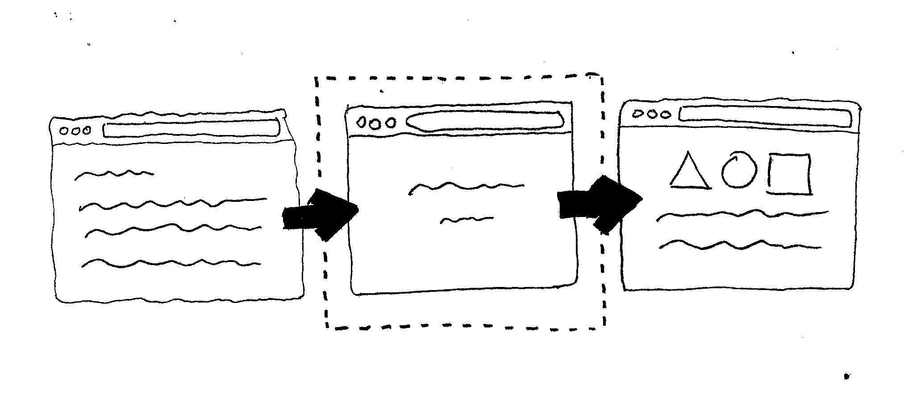

A tool for creating and outputting professional, business-looking HTML5 presentations that can be viewed inside the browser!

## Installation

Paste that at a Terminal prompt.

<pre><code class="language-ruby">ruby -e "$(curl -fsSL http://git.io/SDUT_w)"</code></pre>

## Introduction

__hyhyhy__ is used from the _CLI_ and relies on a series of steps that developers (and even regular users) can go through to build a simple presentation.

Once these steps completed, an HTML5 file is generated which can be accessed, viewed, and hosted online.

## Features

All presentations come with support for a wide range of features, like __Markdown text formatting__, __page transitions__, __sequential transitions__ for objects on the page, __syntax highlighting__, and __mathematical functions__.

There’s also support for __keyboard shortcuts__, showing the position inside the overall __presentation timeline__, __hashed URLs__ for easy deep-linking, __automatic rebuilds__ on content changes, __responsive layouts__, and __touch gestures__ on mobile devices.

All presentations are very well supported across browsers and the library also includes lots of documentation.

<a href="https://github.com/maciejczyzewski/hyhyhy" class="right-text" target="_blank">source code</a>

